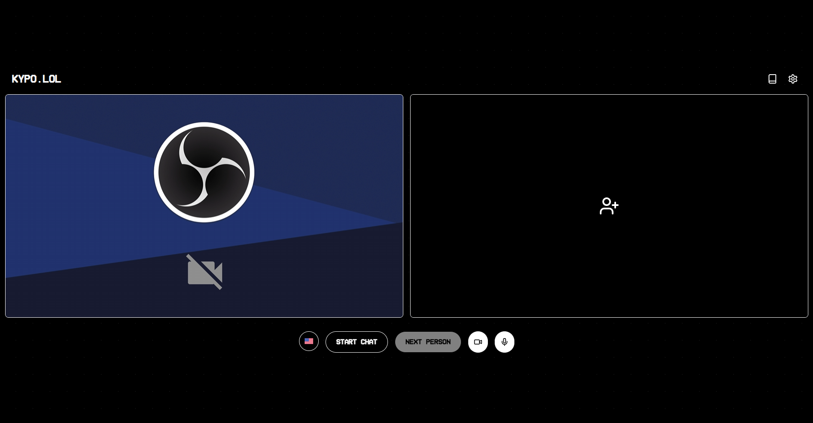
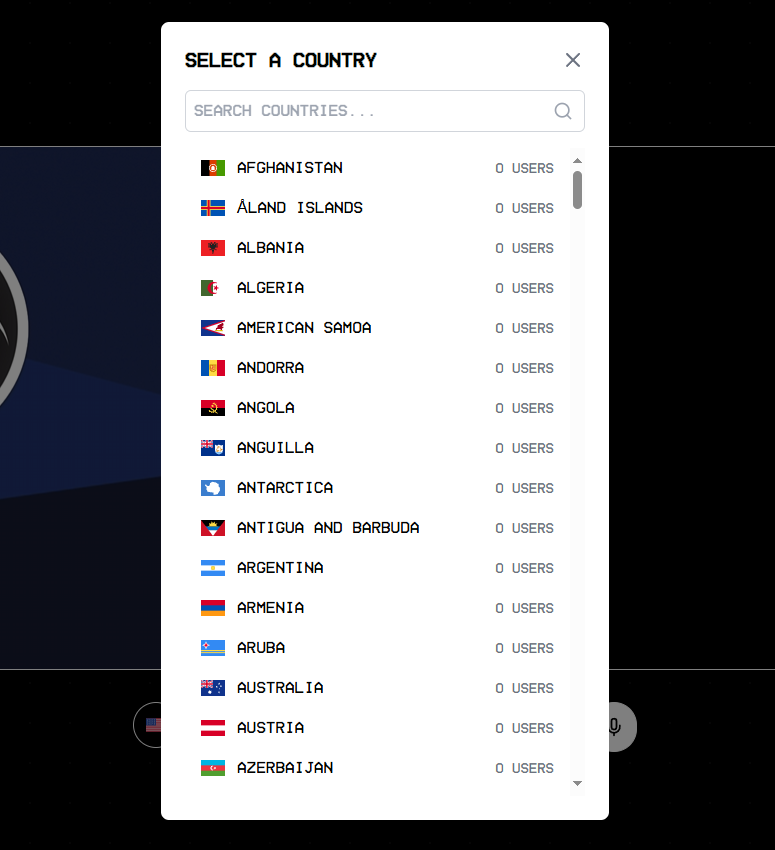

# KyTV a Video Chat (bad) POC

A modern, sleek alternative to Omegle, focusing solely on video chat connections. This project was developed as a 22-hour self-learning hobby project and serves as a prototype for a random video chat platform.

## Features

- **One-on-One Video Chat**: Connect with random strangers from around the world.
- **Country Selection**: Choose to chat with people from specific countries.
- **Sleek, Modern UI**: A clean, intuitive interface for a smooth user experience.
- **Mobile Responsive**: Fully functional on both desktop and mobile devices.

## Tech Stack

- React
- Socket.IO
- WebRTC
- Tailwind CSS

## Disclaimer

**Important:** This project was developed as a rapid prototype over a 22-hour period. While it demonstrates core functionalities, it has not undergone rigorous security auditing or extensive testing. Therefore, it is not recommended for production use without significant review and enhancement.
(this project was just a hobby project, i simply wanted to make a peer to peer video chat site for fun)

## Getting Started

1. Clone the repository
2. Run the .bat file

(If you don't have access to run a .bat file for some reason then just use the sameish commands within it)

## Future Improvements

- Enhanced security measures
- User authentication
- Moderation features
- Text chat integration
- Interests-based matching

## Contributing

As this is a hobby project, contributions are welcome but please note that maintenance may be limited. Feel free to fork the project and adapt it to your needs.

## License

This project is open-source and available under the MIT License.

---

Remember, while this project showcases interesting technologies and concepts, it should be treated as a learning exercise rather than a production-ready application. Always prioritize user safety and data security in real-world implementations of communication platforms.

## Enjoy my mess - Kypo.